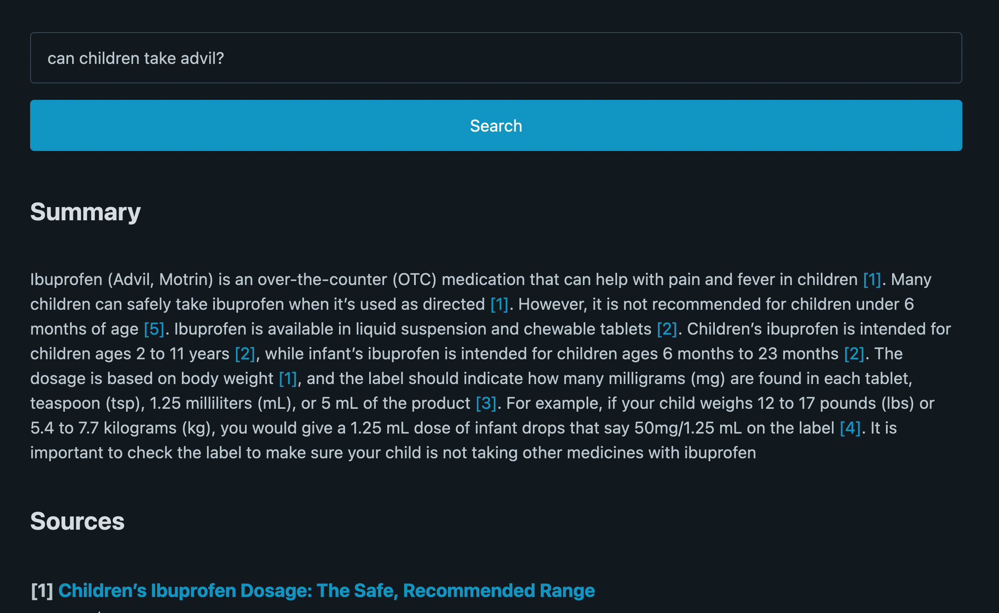
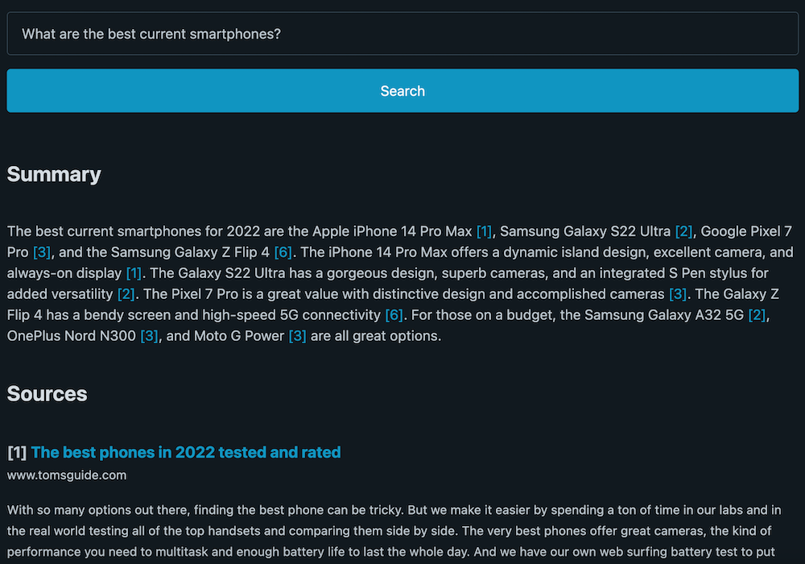

# Researcher

Researcher saves you time by using Google and GPT-3 to answer questions concisely and accurately.  It includes citations so you can look up sources.

It's a different search paradigm from using Google or GPT alone.  With Google, you have to scan through several pieces of SEO-spam content to find the answer.  With GPT, you can't be sure if the answer you got is correct, or where it came from.

Researcher solves these problems by feeding relevant sections from Google search results into GPT-3 to generate an overview.

## Comparison

By feeding web context into a large language model, you can improve accuracy and verify the information.  In this example, you have no way to verify the information from ChatGPT.  It also isn't very specific.  Researcher gives you cited sources and more specific information by relying on context from Google.

| ChatGPT                         | Researcher                      |
|---------------------------------|---------------------------------|
|  |  |

## Screenshots

| Technical Q&A                   | Recommendation                  |
|---------------------------------|---------------------------------|
|  |  |

# Installation and run in virtual environments:

* Clone [this repository](https://github.com/bO-05/researcher) with git.
* Make sure you have Python 3.8+ installed.  As of 12/22, Pytorch doesn't support Python 3.11 on all platforms, so Python 3.10 is recommended.
* Run `cd researcher` to get into the repository folder.
* Run `python3 -m venv MY_ENV` to create the new environment in this directory 
* Run `source MY_ENV/bin/activate` to activate the environment
* Run `python3 -m pip install Flask` to install flask
* Run `python3 -m pip install -r requirements.txt` to install the needed packages.
* Run `python3 -m pip install python-dotenv` to install dotenv package.
* If you want to use `gpt-3.5-turbo` model, you need to run `python3 -m pip install --upgrade openai` to get minimum version 0.27.0 of openai package 
  or alternatively, to install it manually, do the following:
  * Download openai-0.27.0-py3-none-any.whl from https://pypi.org/project/openai/#files
  * Run `python3 -m pip install openai-0.27.0-py3-none-any.whl`.
* Enter your OpenAI API key in `settings.py` in the `OPENAI_KEY` variable.
* Run `python3 -m app.py` or `python3 -m app` to run the application.  By default it will run on port `5000`.
* [Optional] By default, Researcher will scrape Google search results.  This is not always reliable.  If you want more reliability, register a [custom search engine](https://developers.google.com/custom-search/) with Google, then:
  * Enter the API key in `settings.py` in the `SEARCH_KEY` variable.  
  * Enter the custom search engine ID in `SEARCH_ID`.
  * Change the `SEARCH_METHOD` to `api`.

# Usage

* Visit `http://127.0.0.1:5000` to see the search interface.
* Enter a search query and click "Search".  Questions work best.
* It can take 10-20 seconds to get results, depending on the query.  You will see a summary and the sources used to generate the summary.

# How it works

* Initial search results are pulled from Google
* Each of the sites are scraped using requests
* The site HTML is stored in a local sqlite database
* Results are filtered to remove sites with too many ads or trackers
* Chunks of text are pulled from each site, and ranked against the search query
* The top N text chunks are used to generate a summary using GPT-3
* The summary is displayed along with the sources used to generate it

# FAQ

* **Does this cost money?** This uses the OpenAI API, which can cost money depending on your credits.  Each query should cost around 1/3 of a cent.  If you use API mode, it can also cost money based on your Google searches.  Google Custom Search offers 100 free searches per day, then it will cost $5 per 1000 queries.
* **Why does it take so long to get results?**  Researcher runs a search, then scrapes the sites to get relevant context, then  calls an API to summarize the context.  These operations take a long time.  Adjusting some settings may speed this up.  Particularly chunk length and result count.
* **Why do I get a 429 error?** By default, Researcher will scrape Google results.  If you do this too often, you can get a 429 error.  Switch to API mode (explained above) to avoid this.
* **Why do I get an error that the summary couldn't be generated?** The OpenAI API occassionally will have an issue.  This will result in the summary not being shown.  Just run the search again to fix this.

# Future improvements

* Speed up the search process
* Improve algorithm to find optimal text chunks
* Try a self-hosted model instead of GPT-3 (perhaps PEGASUS for summarization, or a fine-tuned BLOOM or T5 variant)
* Summarize text chunks before passing to GPT-3